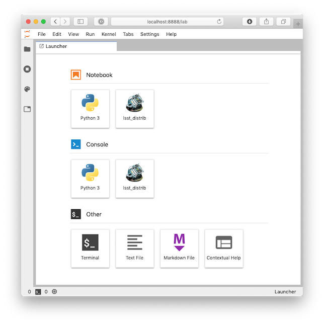

# JupyterLab kernel configuration for the LSST science pipelines

## Introduction
This repository contains a [kernel specification](https://jupyter-client.readthedocs.io/en/stable/kernels.html) for executing [JupyterLab](https://jupyterlab.readthedocs.io/en/stable/) notebooks which use the the *Rubin Observatory* **Legacy Survey of Space and Time** ([LSST](https://lsst.org)) [science pipelines](https://pipelines.lsst.io).

Once deployed in the host where your *JupyterLab notebook server
executes* (e.g. in parctice today  at
[CC-IN2P3](https://doc.lsst.eu  only )  , you will be able to launch notebooks
which use a Python interpreter configured with all the packages
specific to the LSST software distribution and able to run under DASK 

When you launch JupyterLab, you will see a screen similar to the one below:



Push the `lsst_distrib_dask` button to launch a server already configured to use the LSST science pipelines.

## Dependencies
This kernel specification requires that the LSST science pipelines are
installed on the host where JupyterLab executes, under
`/cvmfs/sw.lsst.eu` (see [https://sw.lsst.eu](https://sw.lsst.eu) for
more information). The hosts at the [CC-IN2P3 login
farm](https://doc.lsst.eu/ccin2p3/ccin2p3.html#login-farm) are
configured this way.

Remark that the package dask4in2p3 developed by Bernard Chambon from
CC-IN2P3    and other needed software to run DASK under jupyter
within LSST environement , will be installed under the ${HOME}/.local
directory ...if you are using this area for other anaconda
installation you may have a conflic poping up. 

## Installation

Execute the instructions below in the computer where you run JupyterLab (e.g. your laptop or a server in CC-IN2P3 login farm).

```
cd $HOME
git clone https://github.com/airnandez/lsst-jupyter-kernel.git
cd lsst-jupyter-kernel
bash ./install.sh
rm -r $HOME/lsst-jupyter-kernel
```

After a successful installation, you will find a directory located according to the operating system you deploy on, as follows:

| Operating system   | Installation directory                            |
| ------------------ |:--------------------------------------------------|
| Linux              | `$HOME/.local/share/jupyter/kernels/lsst_distrib_dask` |


This directory is populated with files needed by JupyterLab to launch
your notebook.

When running the code , it will recommand you to source in your bashrc
the same version of the LSST code that you will be using in jupyter
. This is recommended to avoid conflict with the content of your
./local directory ( see bellow ) .

## Customization

At this stage there is no customization possible .
In practice the LSST distribution used will be frozen to the latest
one available at the moment of the installation of this package . 
To move to a new version of the LSST distribution you will have to
re-install the full package.

## Credits

### Author
This tool was developed and are maintained by Pierre Antilogus  at [IN2P3 / CNRS LPNHE](http://lpnhe.in2p3.fr) (Paris, France).
It is mainly an extention of a package  developed and  maintained by
Fabio Hernandez at [IN2P3 / CNRS computing center](http://cc.in2p3.fr)
(Lyon, France) , adding the DASK fucntionalities  to the LSST
environement. 


